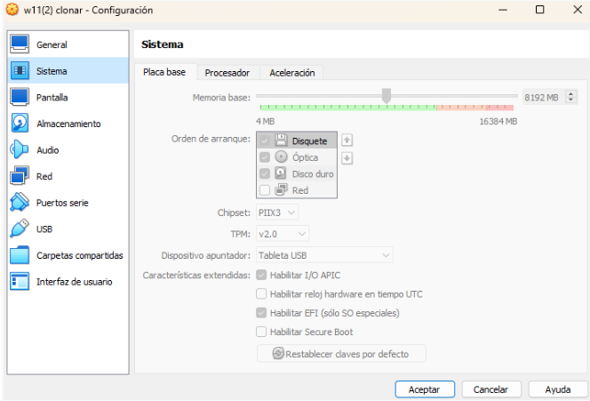
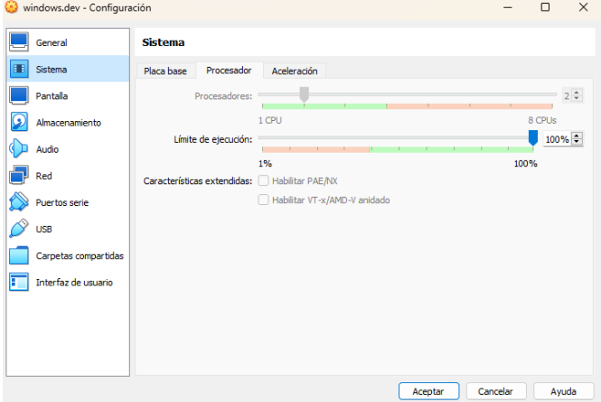
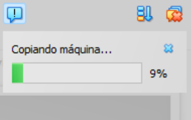
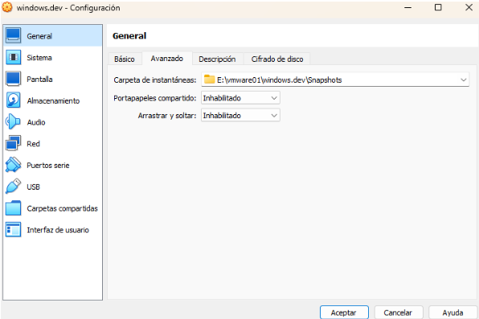
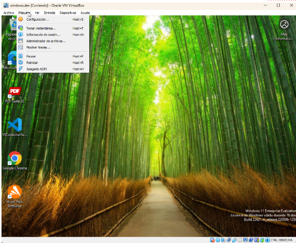
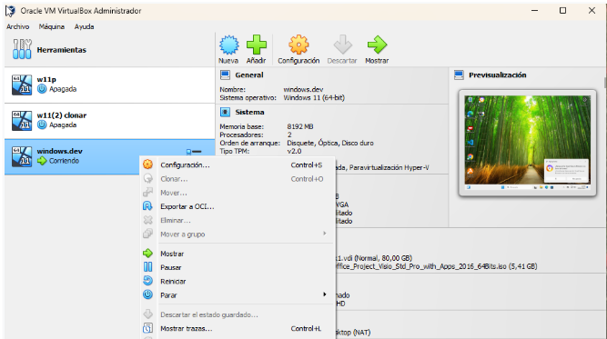
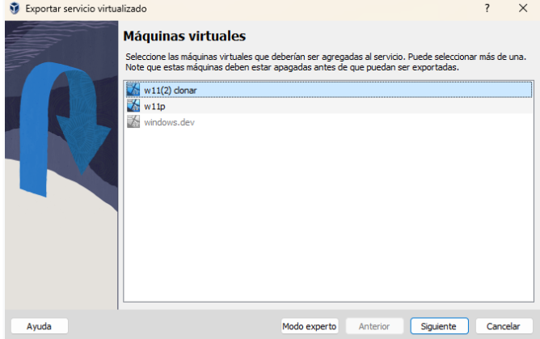
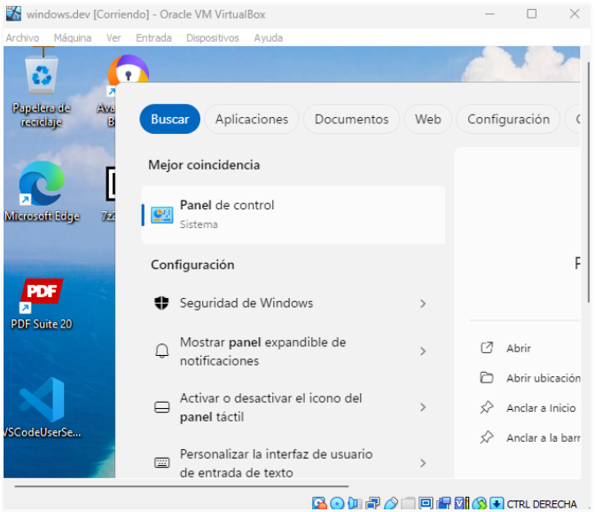
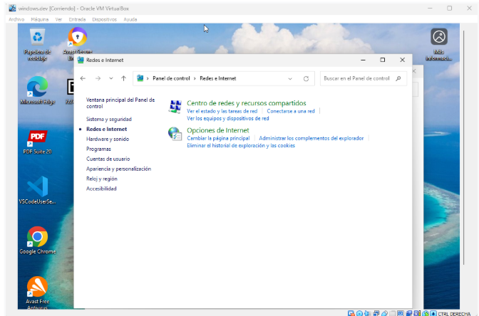
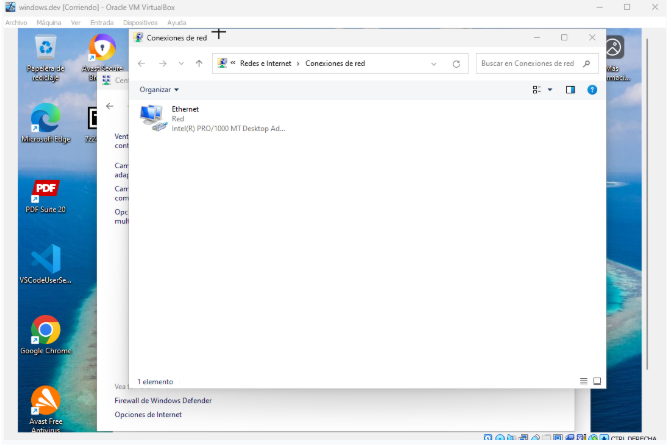

## 1. Configuració de recursos de la màquina virtual
Augmenta la memòria principal (RAM) de la màquina a **8 GB** i assegura’t que disposa de **2 nuclis del processador**.

---

## 2. Clonació de la màquina virtual
Realitza una clonació completa de la màquina virtual creada per disposar d’una còpia idèntica.

- Nom de la nova màquina: **Windows-dev**
- La nova màquina també s’ha d’emmagatzemar a la carpeta corresponent del **disc D:**

---

## 3. Creació i gestió d’un snapshot
Mostra el procés per:

1. Crear un **snapshot** d’una màquina virtual.
2. Canviar el fons de l’escriptori de la màquina.
3. Revertir els canvis restaurant el snapshot creat prèviament.

---

## 4. Exportació en format OVF
Descriu el procés per exportar una màquina virtual en format **OVF**.

> ℹ️ No cal realitzar l’exportació, només documentar els passos, ja que el procés pot ser lent.

