## 🎯 Activitat

**AA2 — Repàs de comandes Linux**

Realització d’exercicis en una màquina virtual GNU/Linux utilitzant el terminal.

***

# 📂 Bloc 1: Sistema de fitxers

### 🔹 Llistar fitxers de `/home`

```bash
ls -la /home
```
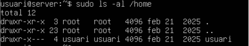
***

### 🔹 Copiar `/etc/passwd` al directori personal com `users.txt`

```bash
cp /etc/passwd ~/users.txt
```
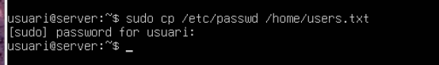
***

### 🔹 Moure `users.txt` a una carpeta `documents` (crear si no existeix)

```bash
mkdir -p ~/documents
mv ~/users.txt ~/documents/
```
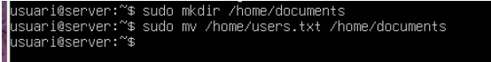
***

### 🔹 Esborrar `users.txt`

```bash
rm ~/documents/users.txt
```
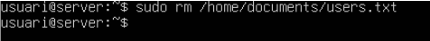
***

### 🔹 Crear tres carpetes amb una sola comanda

```bash
mkdir ~/proves ~/proves2 ~/proves3
```
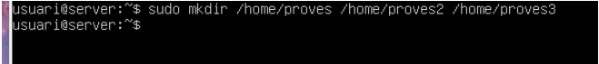
***

# 👥 Bloc 2: Usuaris i grups

### 🔹 Crear usuaris `prova1` i `prova2`

```bash
sudo useradd -m -s /bin/bash prova1
sudo useradd -m -s /bin/bash prova2
```
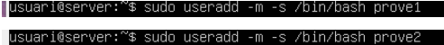
***

### 🔹 Crear grup `alumnes`

```bash
sudo groupadd alumnes
```
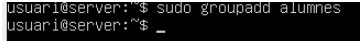
***

### 🔹 Afegir `prova1` a `alumnes` i a sudo

```bash
sudo usermod -aG alumnes prova1
sudo usermod -aG sudo prova1
```
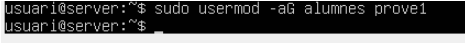
***

### 🔹 Mostrar grups de `prova1`

```bash
groups prova1
```
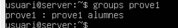
***

### 🔹 Eliminar usuari `prova1` (amb directori)

```bash
sudo userdel -r prova1
```
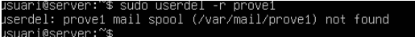
***

# 🔐 Bloc 3: Permisos i propietats

### 🔹 Crear `secret.txt` i treure permisos a “altres”

```bash
touch secret.txt
chmod o-rwx secret.txt
ls -l secret.txt
```
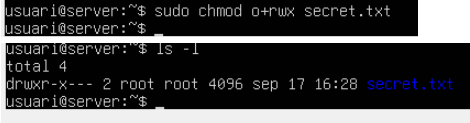
***

### 🔹 Canviar propietari a `prova2`

```bash
sudo chown prova2 secret.txt
ls -l secret.txt
```
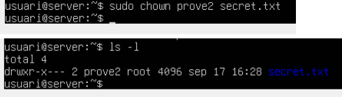
***

### 🔹 Assignar grup `alumnes`

```bash
sudo chgrp alumnes secret.txt
ls -l secret.txt
```
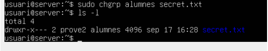
***

### 🔹 Canviar propietari i grup de `proves2`

```bash
sudo chown prova2:alumnes ~/proves2
ls -ld ~/proves2
```
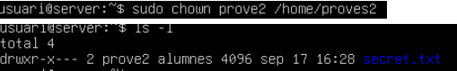
***

### 🔹 Assignar permisos a carpeta `proves2` (propietari i grup RW, altres cap)

```bash
chmod 660 ~/proves2
ls -ld ~/proves2
```
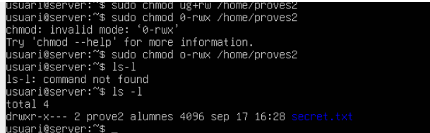
***
